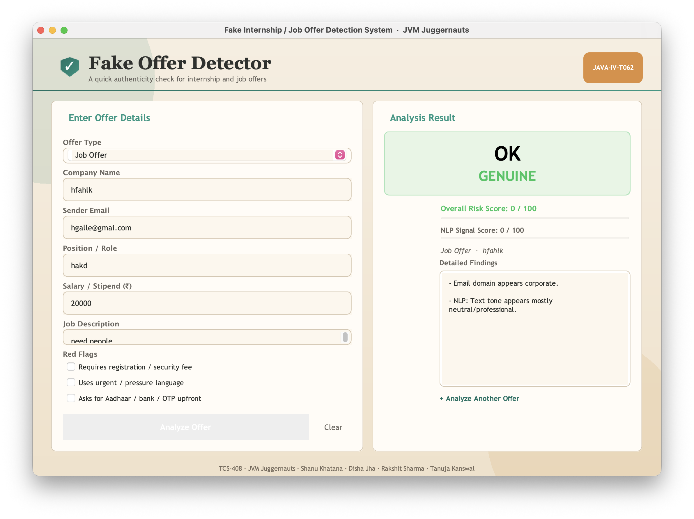
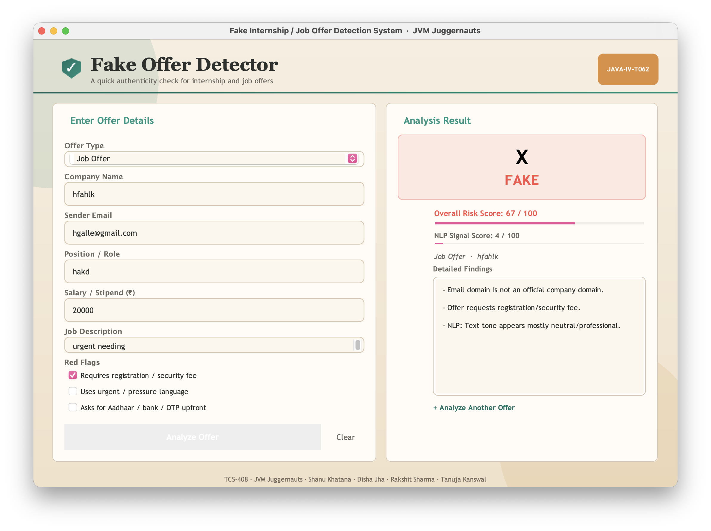

# Fake Offer Letter Detection



> Detects fake job offers using rule-based checks and NLP signals with a risk score system# Fake Offer Letter Detection



# Fake Offer Letter Detection

A Java-based project that helps detect potentially fake internship and job offers using:

- rule-based checks
- lightweight NLP phrase signals
- a combined risk score with verdict labels

The project includes both:

- a modern Java Swing GUI for interactive use
- a console runner for quick testing from terminal

## Features

- Evaluates offers as `GENUINE`, `SUSPICIOUS`, or `FAKE`
- Produces an overall risk score from `0` to `100`
- Separately tracks an NLP signal score from `0` to `100`
- Explains why an offer was flagged through detailed findings
- Supports both internship and full-time job contexts
- Detects common scam indicators such as:
	- free/public email domains
	- unrealistic compensation
	- registration/security fee requests
	- urgency-pressure wording
	- upfront personal-information demand

## Tech Stack

- Java
- Java Swing (`javax.swing`) for desktop UI

No external dependencies are required.

## Project Structure

```
.
├── FakeOfferDetectionGUI.java
├── main/
│   └── MainApp.java
├── model/
│   ├── Offer.java
│   ├── JobOffer.java
│   ├── InternshipOffer.java
│   └── VerificationResult.java
├── service/
│   ├── VerificationEngine.java
│   ├── RuleChecker.java
│   └── NlpSignalAnalyzer.java
└── utils/
		└── InputValidator.java
```

## How Scoring Works

The engine (`VerificationEngine`) combines multiple checks:

1. Email domain legitimacy
2. Salary/stipend realism (different threshold for internships)
3. Fee request presence
4. Urgency and personal info flags
5. Weak company name patterns
6. NLP phrase analysis from offer description
7. Direct suspicious phrase matches

The final score is clamped to `0..100` and classified as:

- `0 - 29` -> `GENUINE`
- `30 - 59` -> `SUSPICIOUS`
- `60 - 100` -> `FAKE`

## Prerequisites

- JDK 8 or newer installed
- `javac` and `java` available in your terminal path

Check your Java version:

```bash
javac -version
java -version
```

## Build

From the project root:

```bash
javac FakeOfferDetectionGUI.java main/MainApp.java model/*.java service/*.java utils/*.java
```

## Run

### 1) GUI Mode

```bash
java FakeOfferDetectionGUI
```

### 2) Console Demo Mode

```bash
java main.MainApp
```

## Example Output (Console)

```text
Risk Score: 100
NLP Score: 34
Result: FAKE
```

Values will differ depending on the sample offer and rule/NLP matches.

## Notes and Limitations

- Current NLP analysis is phrase-signal based, not a trained ML model.
- The rule thresholds are heuristic and can be tuned for different domains.
- This tool should assist screening, not replace human verification.

## Team

JVM Juggernauts (`JAVA-IV-T062`)

- Shanu Khatana
- Disha Jha
- Rakshit Sharma
- Tanuja Kanswal

## License

This project is licensed under the terms in [LICENSE](LICENSE).
